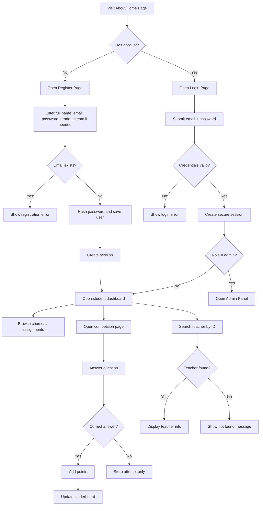

# Full System Flowchart (Mermaid)

```mermaid
flowchart TD
    A[Visit About/Home Page] --> B{Has account?}
    B -- No --> C[Open Register Page]
    C --> D[Enter full name, email, password, grade, stream if needed]
    D --> E{Email exists?}
    E -- Yes --> F[Show registration error]
    E -- No --> G[Hash password and save user]
    G --> H[Create session]
    H --> I[Open student dashboard]

    B -- Yes --> J[Open Login Page]
    J --> K[Submit email + password]
    K --> L{Credentials valid?}
    L -- No --> M[Show login error]
    L -- Yes --> N[Create secure session]

    N --> O{Role = admin?}
    O -- Yes --> P[Open Admin Panel]
    O -- No --> I

    I --> Q[Browse courses / assignments]
    I --> R[Open competition page]
    R --> S[Answer question]
    S --> T{Correct answer?}
    T -- Yes --> U[Add points]
    U --> V[Update leaderboard]
    T -- No --> W[Store attempt only]

    I --> X[Search teacher by ID]
    X --> Y{Teacher found?}
    Y -- Yes --> Z[Display teacher info]
    Y -- No --> AA[Show not found message]
```

> You can render this in Markdown editors that support Mermaid (e.g., GitHub, Obsidian, Typora with plugin).
